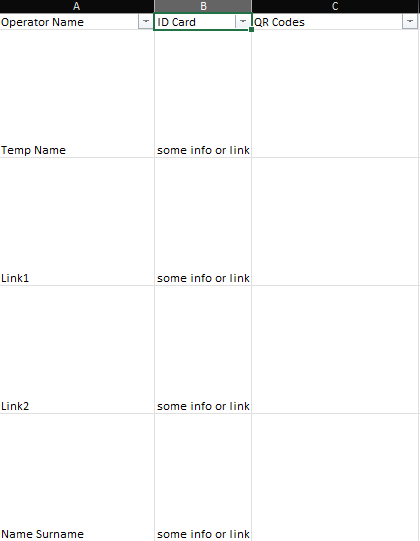
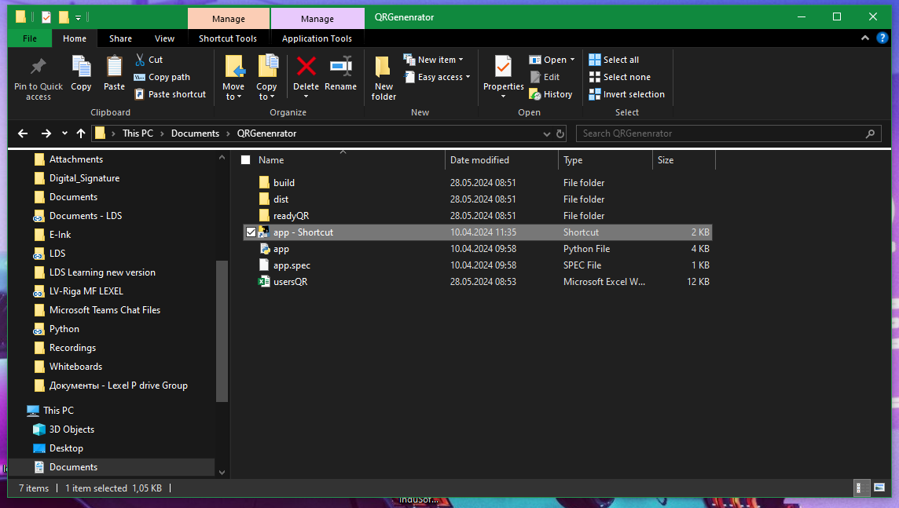
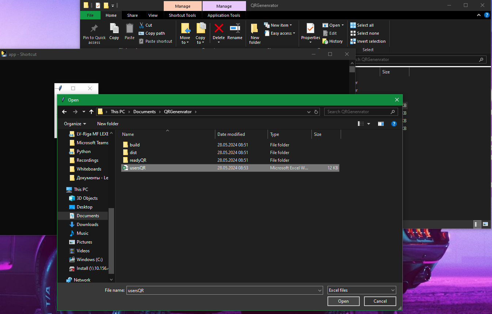
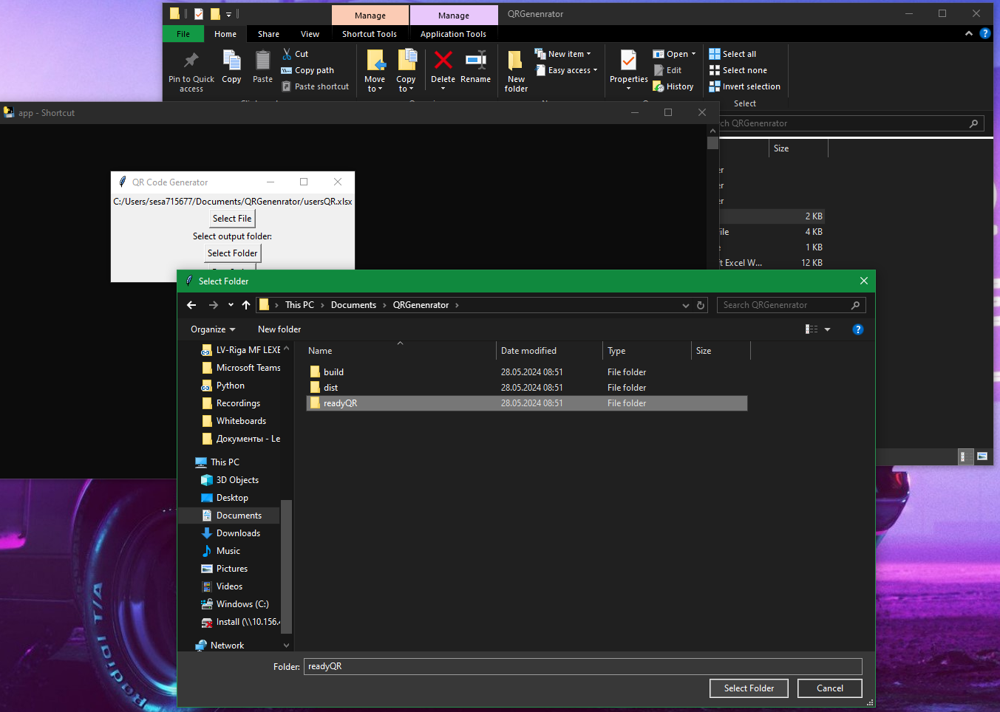
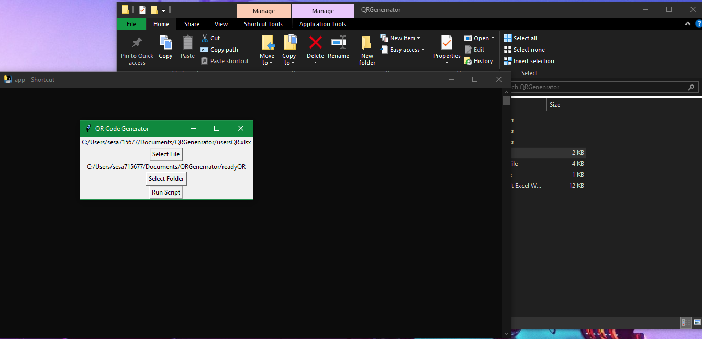
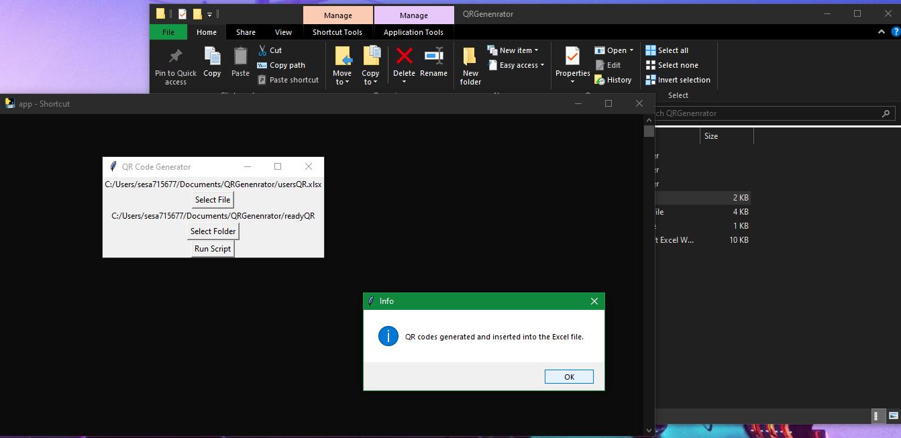

<h1>Instructions</h1<>

Extract zip file, create folder where to store QR codes and follow instructions further

1.Prepare data in userQR.xlsx (Type Name and information which should be stored in QR file. Example in a first row)

 

2. Start app - Shortcut
  
  
 

3. Select a file which contains information with name and data

  
 

4. Select a destination folder it should be in the same folder

  
 

5. After selecting file and destination folder. Run the script.
  

(Please close excel file before running script for not to interfere with script )

 

6. After it is done close all messages and script windows before opening Excel or images folder. Images should be a in destination folder

